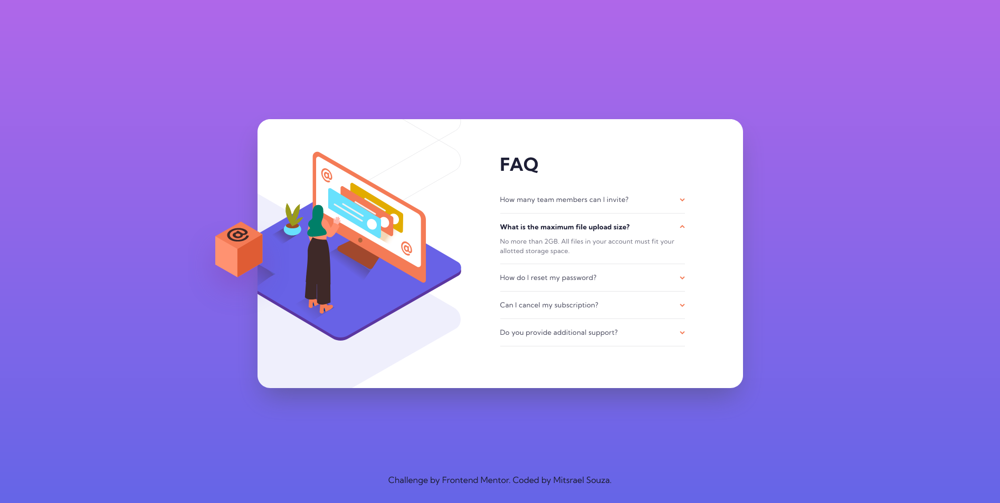

# Frontend Mentor - FAQ accordion card solution

This is a solution to the [FAQ accordion card challenge on Frontend Mentor](https://www.frontendmentor.io/challenges/faq-accordion-card-XlyjD0Oam). Frontend Mentor challenges help you improve your coding skills by building realistic projects.

## Table of contents

-   [Overview](#overview)
    -   [The challenge](#the-challenge)
    -   [Screenshot](#screenshot)
    -   [Links](#links)
-   [My process](#my-process)
    -   [Built with](#built-with)
    -   [What I learned](#what-i-learned)
    -   [Continued development](#continued-development)
    -   [Useful resources](#useful-resources)
-   [Author](#author)
-   [Acknowledgments](#acknowledgments)

## Overview

### The challenge

Users should be able to:

-   View the optimal layout for the component depending on their device's screen size
-   See hover states for all interactive elements on the page
-   Hide/Show the answer to a question when the question is clicked

### Screenshot

<div align="center">
    
  
  <br /><br /><br />


<br /><br /><br />

</div>

### Links

-   Solution URL: [GitHub source code](https://github.com/M-its/faq-accordion-card)
-   Live Site URL: [Product preview card component page](https://m-its.github.io/faq-accordion-card/)

## My process

### Built with

-   Semantic HTML5 markup
-   CSS custom properties
-   Flexbox
-   [Tailwind](https://tailwindcss.com/) - Tailwind
-   Mobile-first workflow

### What I learned

In this project, I learned how to make an acordion using javascript and tailwind css.

See below the things I learned this time:

```css
.details {
    transition: height 300ms ease-in-out;
    overflow: hidden;
}

details summary {
    transition: color 300ms ease-in-out;
}

details summary:after {
    transition: 200ms linear;
}

details[open] summary:after {
    transform: rotate(180deg);
}
```

```js
detailsElement.addEventListener("click", (e) => {
    if (e.target.classList.contains("details-summary")) {
        e.preventDefault()

        const detail = e.target.parentNode

        detailsGroup.forEach((otherDetail) => {
            if (otherDetail !== detail && otherDetail.hasAttribute("open")) {
                close(otherDetail)
            }
        })

        if (!detail.hasAttribute("open")) {
            open(detail)
        } else {
            close(detail)
        }
    }
})
```

### Continued development

I still need to pratice more JS and CSS animations.

### Useful resources

-   [Tailwind - Documentation](https://tailwindcss.com/docs/installation) - This documentation guided me throughout the project.
-   [W3 schools - HTML <details> Tag](https://www.w3schools.com/TAGS/tag_details.asp) - This documentation guided me throughout the project.

## Author

-   GitHub - [@M-its](https://github.com/M-its)
-   Frontend Mentor - [@M-its](https://www.frontendmentor.io/profile/M-its)
-   Codepen - [@M-its](https://codepen.io/m-its)

## Acknowledgments

The accordion effect was inpired by [keith Pickering's](https://codepen.io/keithpickering/pen/PeBpwG?editors=1010) code.
